# Multi-Outcome Markets — User Flow & Math

A multi-outcome market lets bettors back **one of up to four outcomes**
(0/1/2/3). Each bettor's _amount_ and _side_ are encrypted client-side and
stay private through the entire lifecycle — only the **per-outcome pool
totals** are revealed on-chain as bets settle. When the market resolves,
winners split the entire pool in proportion to their share of the winning
side.

All amounts are in **micro-USDC** (1 USDC = 1,000,000 micro). Diagrams use
USDC for readability.

---

## 1. Market lifecycle (state machine)

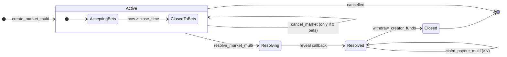

`state` field on the `Market` account: `0=Active`, `2=Resolved`.
"Resolving" is the brief window between `resolve_market_multi` queueing the
MPC computation and the Arcium callback writing the result.

---

## 2. Cast of characters & on-chain accounts

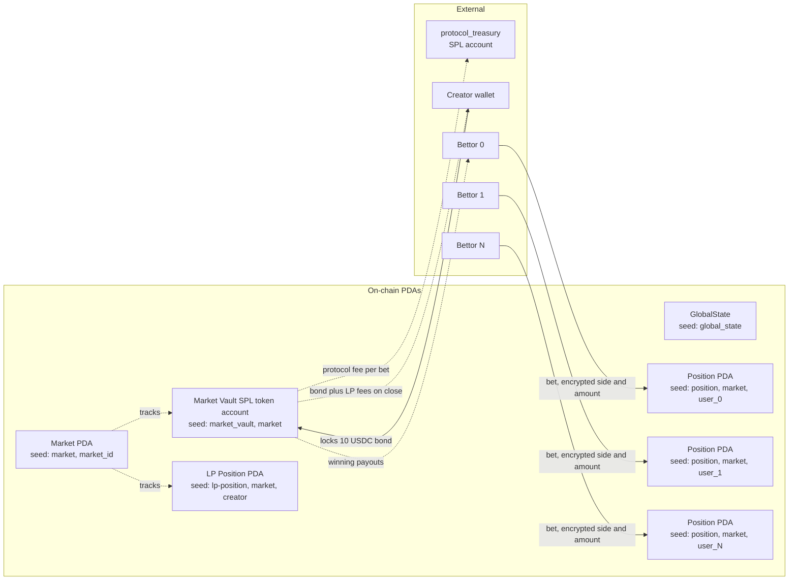

`Market` stores plaintext: `revealed_pool_0..3`, `accumulated_lp_fees`,
`payout_ratio`, `outcome`, `state`. The bettor's `side` and `amount` only
ever live encrypted (in `EncryptedPosition` + inside the MPC circuit).

---

## 3. End-to-end user journey

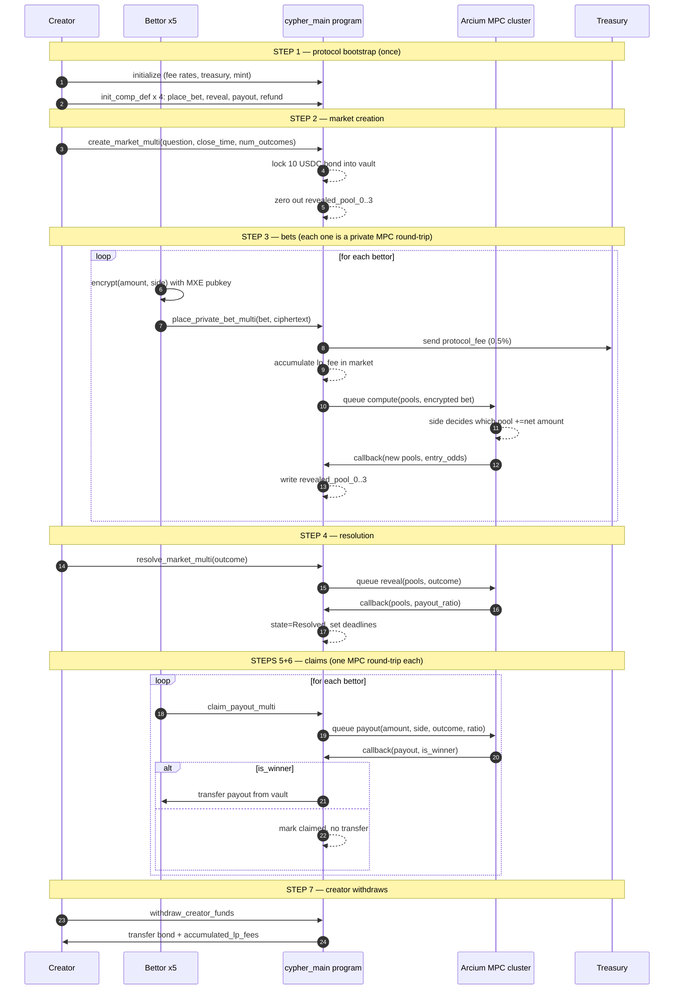

---

## 4. What happens inside `place_private_bet_multi`

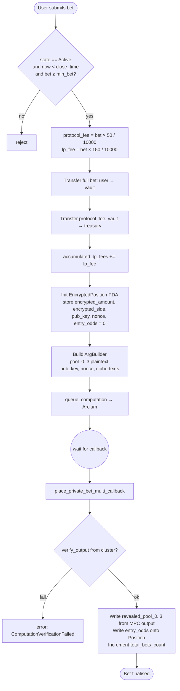

**Why two phases?** The fee/transfer half runs in the user's submitting
transaction (atomic with the SPL transfer). The pool update half waits for
the Arcium MPC cluster to decrypt `side` privately, add `net` to the chosen
pool, and sign the result. Only the **revealed pool totals** come back to
chain — the individual side is never written anywhere in the clear.

---

## 5. The MPC computation (place bet, in detail)

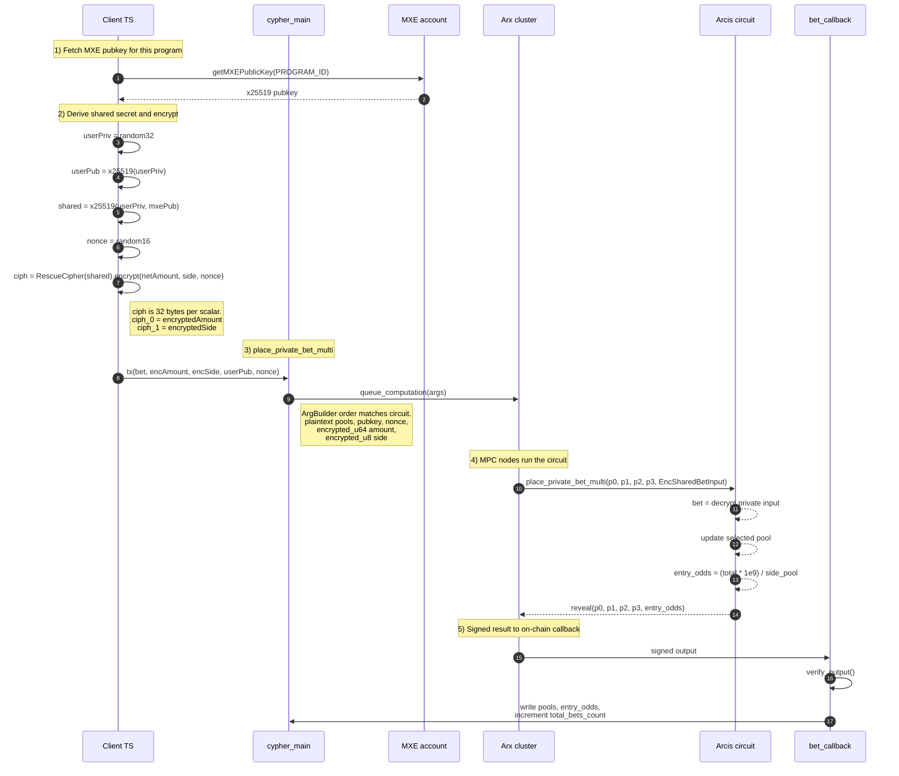

**Decryption privacy:** the ciphertexts are decrypted _inside the MPC
secret-shared computation_ — no single Arx node ever sees the plaintext
`(amount, side)`. The match-arm pool update happens on the shared values,
and only the resulting **pool totals** (and `entry_odds`) are `reveal()`-ed
back as plaintext.

---

## 6. The math — per-bet fees & pool accumulation

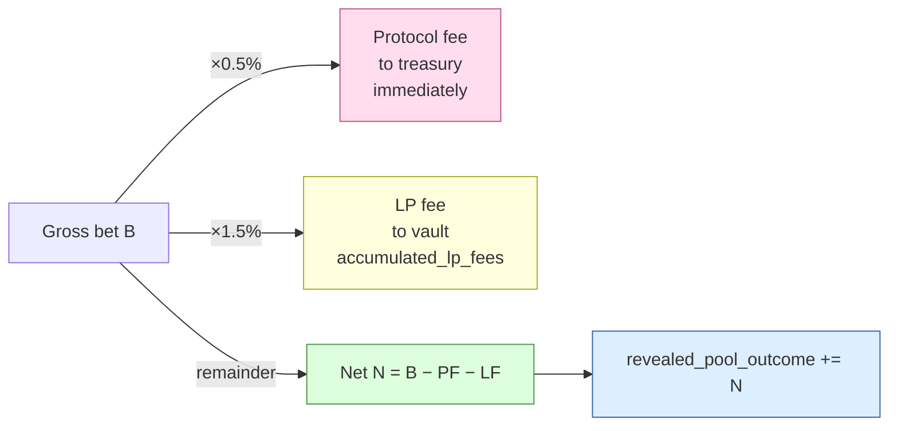

Code references:

| Quantity        | Formula                            | Source                                       |
| --------------- | ---------------------------------- | -------------------------------------------- |
| protocol_fee    | `bet × protocol_fee_rate / 10_000` | `lib.rs:602`                                 |
| lp_fee          | `bet × lp_fee_rate / 10_000`       | `lib.rs:607`                                 |
| net (encrypted) | `bet − protocol_fee − lp_fee`      | client-side (`multi_outcome_e2e.ts:549`)     |
| pool update     | `pool_side += net`                 | circuit (`encrypted-ixs/src/lib.rs:171-176`) |

Vault invariant during the betting window:

```
vault_balance == creator_bond
              + Σ bets
              - Σ protocol_fees_sent_to_treasury
```

---

## 7. The math — resolution & payout ratio

When the creator resolves, the reveal circuit returns a **payout ratio**
that scales each winner's net bet to their total claim.

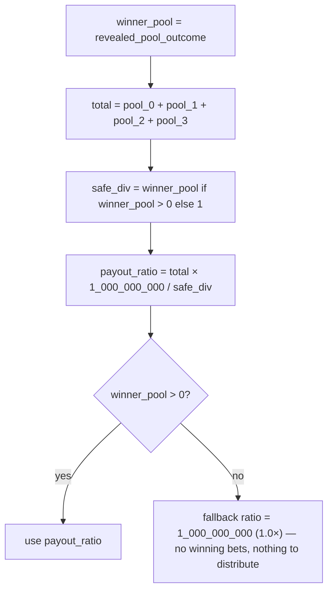

`payout_ratio` is scaled by `1e9` to keep MPC integer-only.

### Per-user payout

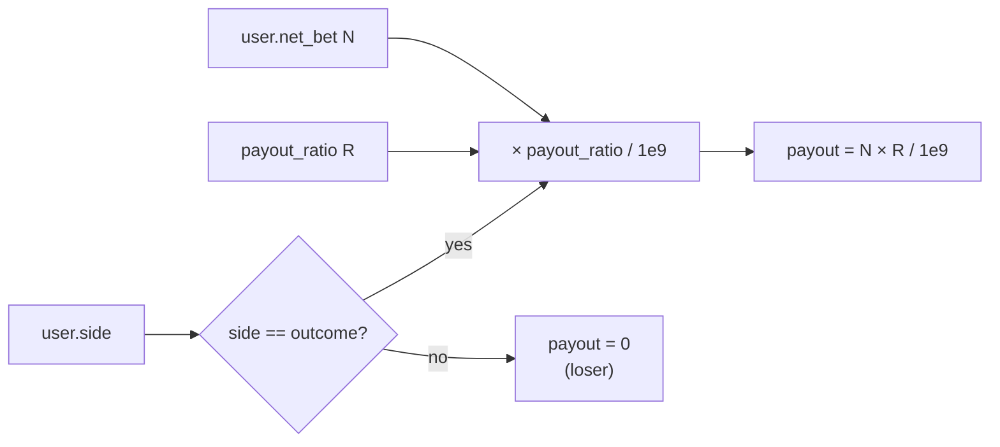

**Algebraic identity** (why this is "share of the losers' pool"):

```
payout_ratio = total / winner_pool                 (scale aside)

payout       = net_bet × total / winner_pool
             = net_bet + net_bet × (total − winner_pool) / winner_pool
             = net_bet + (net_bet / winner_pool) × loser_pools
                       └─ share of winning side ─┘
```

So a winner gets their own net bet back plus a proportional slice of
everything bet on the losing outcomes.

---

## 8. Worked example — test scenario

Question: _"Who will be the president of the USA?"_ — `num_outcomes = 4`.
Resolves to **outcome 0 (Donald Trump)**.

### 8a. Bets placed

| Bettor     | Side (outcome) | Gross bet | Protocol fee (0.5%) | LP fee (1.5%) | Net into pool |
| ---------- | -------------- | --------: | ------------------: | ------------: | ------------: |
| MagaFan1   | 0 (Trump)      |     10.00 |                0.05 |          0.15 |      **9.80** |
| Liberty22  | 1 (JFK)        |      5.00 |               0.025 |         0.075 |      **4.90** |
| MagaFan2   | 0 (Trump)      |     20.00 |                0.10 |          0.30 |     **19.60** |
| FedPaper   | 2 (Madison)    |     15.00 |               0.075 |         0.225 |     **14.70** |
| Hope4ward  | 3 (Obama)      |      8.00 |                0.04 |          0.12 |      **7.84** |
| **Totals** |                | **58.00** |            **0.29** |      **0.87** |     **56.84** |

### 8b. Pools after Step 3 (settled by Arcium callbacks)

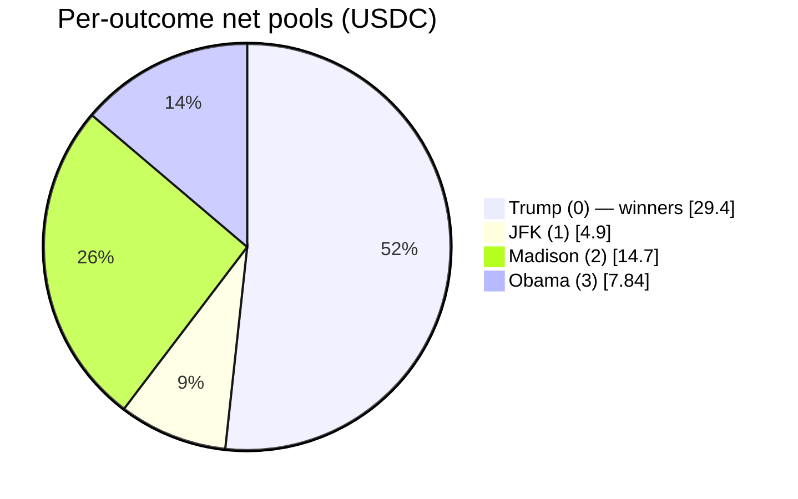

```
revealed_pool_0 = 9.80 + 19.60 = 29.40   ← winner pool
revealed_pool_1 = 4.90
revealed_pool_2 = 14.70
revealed_pool_3 = 7.84
total           = 56.84
```

### 8c. Resolve — payout ratio

```
payout_ratio = total × 1e9 / winner_pool
             = 56.84 × 1e9 / 29.40
             = 1_933_333_333          ≈ 1.9333×
```

### 8d. Per-bettor settlement

| Bettor    | Side | Net bet |  × ratio |    Payout | P&L (vs gross) |
| --------- | ---- | ------: | -------: | --------: | -------------: |
| MagaFan1  | 0 ✓  |    9.80 | × 1.9333 | **18.95** |          +8.95 |
| MagaFan2  | 0 ✓  |   19.60 | × 1.9333 | **37.89** |         +17.89 |
| Liberty22 | 1 ✗  |    4.90 |        — |      0.00 |          −5.00 |
| FedPaper  | 2 ✗  |   14.70 |        — |      0.00 |         −15.00 |
| Hope4ward | 3 ✗  |    7.84 |        — |      0.00 |          −8.00 |

Sum of winner payouts: `18.95 + 37.89 = 56.84 = total net pool` ✓
— the pool drains exactly to zero after all winners claim.

### 8e. Final vault reconciliation

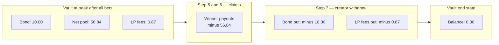

```
vault_after_bets   = 10.00 (bond) + 58.00 (bets) − 0.29 (protocol→treasury) = 67.71
vault_after_claims = 67.71 − 56.84 (winners) = 10.87
vault_final        = 10.87 − 10.00 (bond) − 0.87 (LP fees) = 0.00

treasury           = 0.29 USDC                  (protocol earnings)
creator total      = 10.00 (bond back) + 0.87 (LP fees) = 10.87 USDC
```

Money in = money out: `58.00 gross bets = 56.84 paid to winners + 0.29 treasury + 0.87 creator LP fees` ✓.

---

## 9. The claim flow (per bettor)

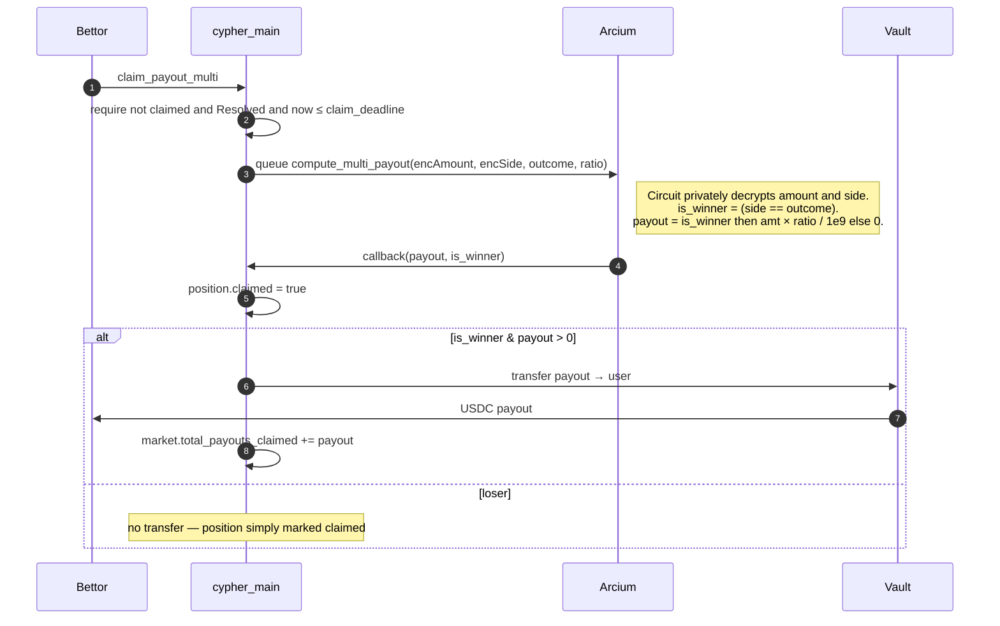

The `claimed` flag prevents double-claims; the `claim_deadline` window
prevents lingering claims after the creator has withdrawn.

---

## 10. Edge cases worth knowing

| Situation                                        | What happens                                                                                                                             |
| ------------------------------------------------ | ---------------------------------------------------------------------------------------------------------------------------------------- |
| `winner_pool == 0` (no bets on the winning side) | `payout_ratio = 1e9` (1.0×); winners would get back their net stake, but there are none — pool is stranded until `admin_claim_remaining` |
| Market never resolved by deadline                | Anyone with a position can call `claim_refund_multi` to get `net_bet` back (Arcium decrypts amount, returns it)                          |
| Bettor sides ≥ `num_outcomes` (invalid index)    | Lands in `pool_3` via the `_` match arm — unrecoverable as winnings unless outcome ends up 3; client must validate                       |
| Two bets from same user on same market           | Disallowed — `position` PDA seeded by `(market, user)` is single-init                                                                    |
| `cancel_market` after first bet                  | Rejected: `total_bets_count > 0` blocks cancellation                                                                                     |

---

## Quick file map

| Concern                                                                                                                  | File                                 |
| ------------------------------------------------------------------------------------------------------------------------ | ------------------------------------ |
| State accounts (`Market`, `EncryptedPosition`, `LPPosition`, `GlobalState`)                                              | `programs/cypher_main/src/states.rs` |
| `create_market_multi`, `place_private_bet_multi`, `resolve_market_multi`, `claim_payout_multi`, `withdraw_creator_funds` | `programs/cypher_main/src/lib.rs`    |
| MPC circuits (`place_private_bet_multi`, `reveal_market_outcome_multi`, `compute_multi_payout`, `compute_multi_refund`)  | `encrypted-ixs/src/lib.rs`           |
| End-to-end test runner                                                                                                   | `tests/multi_outcome_e2e.ts`         |
